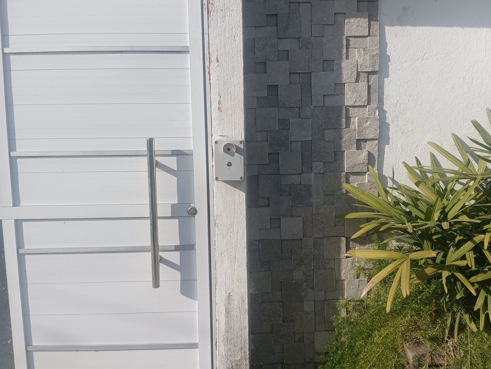
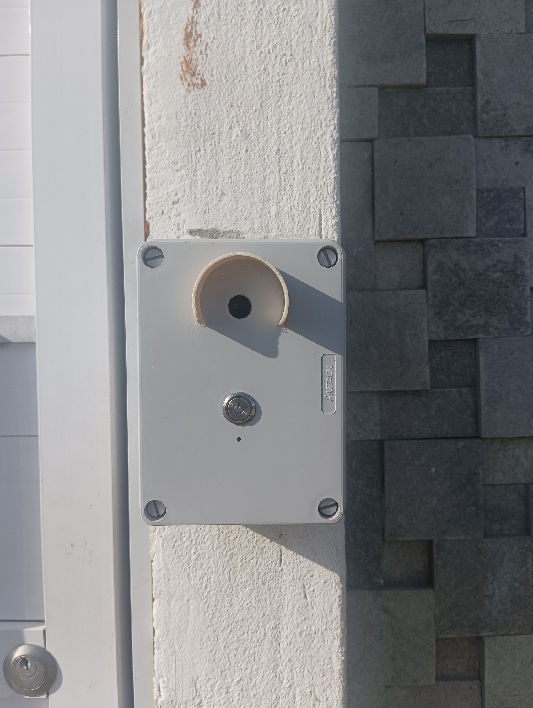
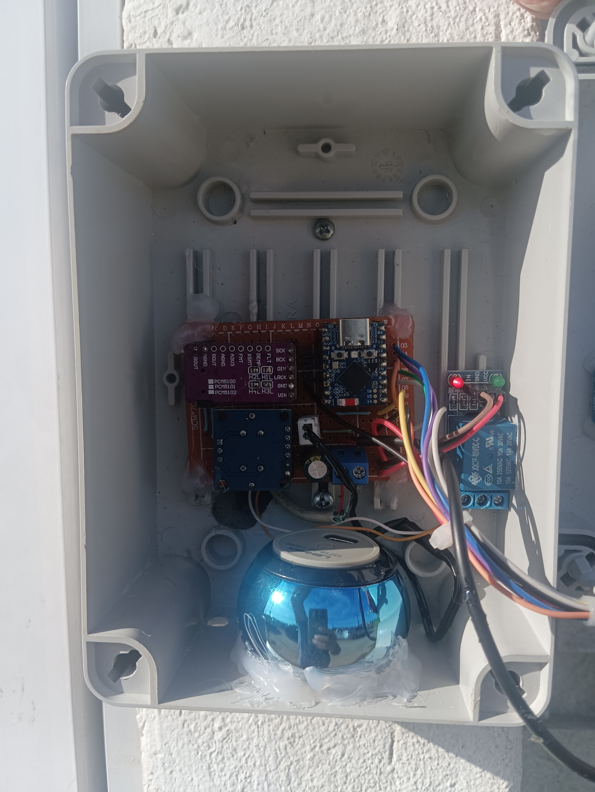
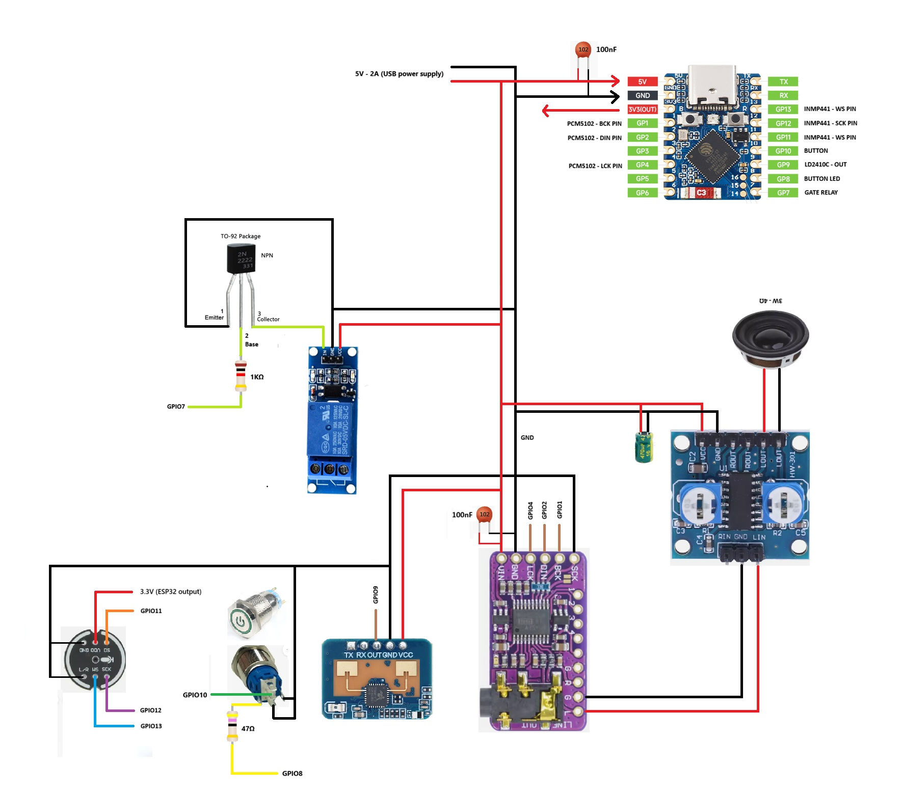

# Smart AI Door Intercom

An autonomous, intelligent, and privacy-conscious residential gatekeeper built with Home Assistant, ESPHome and AI.

This project implements a fully autonomous residential intercom system capable of interacting with visitors and delivery drivers.

The system prioritizes privacy and security and will **never reveal whether residents are home**.

## Key Features

- Autonomous AI interaction with visitors and delivery drivers
- Privacy-first design that prevents social engineering
- Smart delivery management when nobody is home
- Internal voice announcements inside the house
- Resident access via NFC tags or facial recognition
- Offline fallback mode when internet is unavailable
- Do Not Disturb schedule during night hours

## Hardware

### External Unit (Gate)

- ESP32-S3 Zero
- LD2410C mmWave radar
- INMP441 I2S microphone
- PCM5102A DAC
- Passive NFC Tag
- PAM8406 amplifier
- Speaker 3W / 4Ω / 35mm
- Illuminated metal push button
- RTSP camera
- USB wall outlet module 5V / 2A

### Internal Unit (Announcements)

- Home Assistant host PC
- USB sound card
- Desktop speakers

## System Flow

### 1. Special Operating Modes

**Do Not Disturb (23:00 - 07:00)**  
If the doorbell button is pressed during night hours, the system plays a local audio message informing that residents are unavailable and asking the visitor to return in the morning.

**Offline Fallback**  
If the internet connection is unavailable, the system switches to offline mode and plays a message informing that the system is temporarily offline.

---

### 2. Resident Access

Residents can open the gate using two authentication methods:

**NFC Access (Primary)**  
A passive NFC tag is installed at the gate. When a resident scans it with their smartphone, Home Assistant triggers the gate relay.

**Facial Recognition (Secondary)**  
If a person remains in front of the gate for several seconds, the system captures a snapshot from the camera and analyzes it using AI. If the person is recognized as a resident, access can be granted.

---

### 3. Visitor Interaction

During normal hours and when internet connectivity is available, the system performs a fully autonomous interaction.

1. **Button Press**  
   The visitor presses the illuminated button.

2. **Greeting**  
   A pre-recorded greeting message is played.

3. **Voice Capture**  
   After the greeting finishes, the microphone activates and records the visitor's message.

4. **AI Processing**  
   The audio is transcribed and analyzed by the AI to determine the visitor's intent.

5. **Intent Classification**
   The system determines whether the visitor is:
   - a delivery driver
   - a personal visitor
   - an unknown interaction

---

### 4. Delivery Flow

If the AI identifies a delivery:

- The system asks who the delivery is for.
- Home Assistant checks the `group.familia` presence status.

**Resident Home**
- A voice announcement is played inside the house.

**Resident Away**
- The AI asks the driver if they can deliver to an alternative address on the same street.
- If the driver agrees, the alternative address is provided.

---

### 5. Visit Flow

If the interaction is a personal visit:

**Resident Home**
- The system announces the visitor inside the house.

**Resident Away**
- The system offers to record a message.
- The message is transcribed and sent as a private notification to the specific resident.

---

### Security Model

For security reasons:

- The gate **never opens automatically for visitors or deliveries**.
- Access is restricted to **verified residents only** (NFC or facial recognition).
- The AI **never confirms whether residents are home**.

## 🤖 AI Prompt & Local Audio Files

### AI Prompt

The AI conversation prompt for the intercom is saved in: homeassistant/prompt_AI_conversation.txt

**Assist Configuration:**

- **Name:** Porteiro  
- **Conversation Agent:** Google AI Conversation  
- **STT:** Google AI STT (Portuguese Brazil)  
- **TTS:** Piper (chosen for lower latency)

The prompt ensures **privacy and security** by never revealing whether residents are home to visitors or delivery drivers.

---

### Local Audio Files

The system uses the following audio files, located in `/config/www/`:

| File | Purpose |
|------|---------|
| `ola_ajudar.mp3` | Initial greeting for visitors |
| `sistema_offline.mp3` | Message played when the system is offline |
| `fora_do_horario.mp3` | Message during the “Do Not Disturb” period |

**How the audio files were generated:**

1. Open **Developer Tools → Actions** in Home Assistant.  
2. Select **Entities:** `Piper`  
3. Set **Target:** `VLC-TELNET`  
4. Type the phrase for the audio and execute the action.  
5. Before generating, clear the TTS folder using File Editor (easier to locate new files).  
6. After generation, download the audio files and save them in `/config/www/`.

## Project Structure

This project is organized as follows:

- esphome/
  - intercom.yaml
- homeassistant/
  - automation/
    - Ativar Monstrão por Presença com Cooldown.yaml
    - Monstrinho - Captura Recado v3.yaml
    - NFC - Abrir portão e Notificar Usuário.yaml
    - Notificação de visita.yaml
    - Porteiro - Direcionar Notificação de Entrega.yaml
    - Tratar clique na notificação
  - scripts/
    - Anunciar entrega na casa.yaml
    - Anunciar visita na casa.yaml
    - Notificação - Entrega no vizinho.yaml
    - Notificação - Recusa de Entrega no vizinho.yaml
    - Processar Reconhecimento Facial por Movimento.yaml
    - Registrar e Notificar Recado.yaml
- audio/
  - ola_ajudar.mp3
  - sistema_offline.mp3
  - fora_do_horario.mp3
- images/
  - intercom_installed.jpg
  - front_panel.jpg
  - front_internal_setup.jpg
  - rear_internal_setup.jpg
  - wiring_diagram.jpg
- README.md
- LICENSE
  
## 📸 Project Gallery

### Intercom Installed

### Front Panel Detail

### Internal Hardware Setup (Front)

### Internal Hardware Setup (Rear)

### Wiring Diagram

